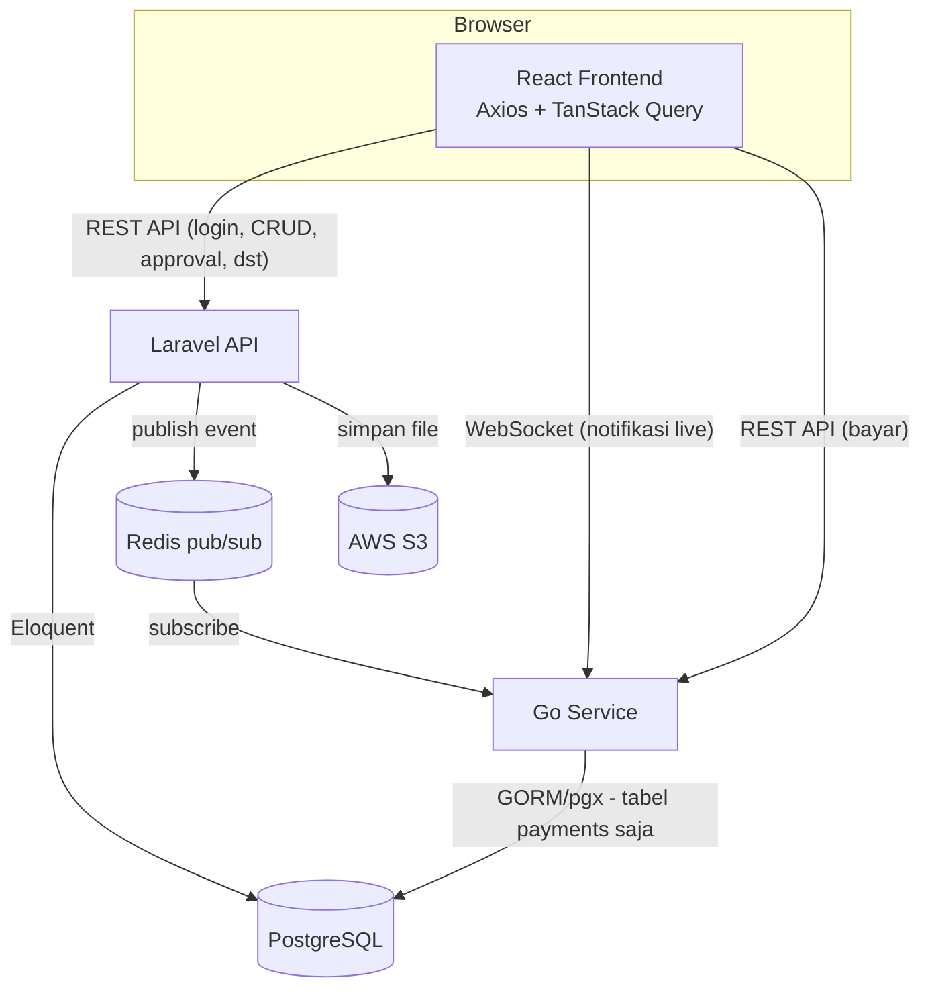
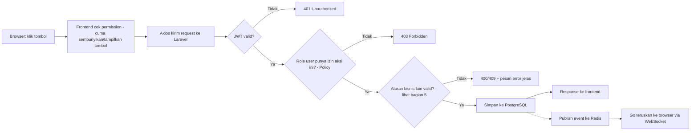
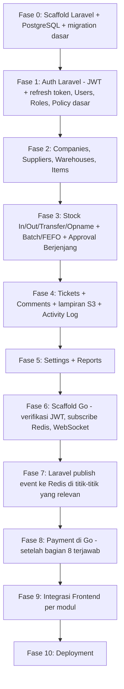

# Rencana Backend TaskFlow

## Context

Seluruh aplikasi TaskFlow sampai saat ini berjalan **tanpa backend sungguhan** — semua data (`data/*.tsx`) cuma array di memori React, reset tiap refresh halaman, dan login cuma mencocokkan email tanpa cek password. Ini didokumentasikan lengkap per fitur di [`docs/features/`](features/00-overview.md) dan alurnya di [`docs/feature-flows.html`](feature-flows.html).

`README.md` proyek ini sejak awal menyebut stack FeathersJS + MongoDB, tapi setelah didiskusikan ulang, **stack yang benar-benar dipakai diputuskan berbeda** (lihat bagian 1). `README.md` perlu diperbarui menyesuaikan ini — dicatat sebagai pekerjaan terpisah, bukan bagian dari backend itu sendiri.

**Dokumen ini murni rencana — belum ada kode backend yang ditulis.** Tujuannya biar arsitektur & cakupannya disepakati dulu sebelum mulai coding.

---

## 1. Stack yang Dipakai

Backend dipecah jadi **2 service terpisah**, bukan satu aplikasi tunggal:

| Service | Bahasa/Framework | Tanggung Jawab |
|---|---|---|
| **API Utama** | **Laravel (PHP)** | Login/Auth, semua modul admin & logika bisnis — hampir seluruh isi [`docs/features/`](features/00-overview.md) |
| **Realtime & Payment** | **Go (Golang)** | Notifikasi real-time (WebSocket) dan pemrosesan pembayaran |
| **Database** | **PostgreSQL** (1 instance, dipakai bersama) | Dipilih karena didukung penuh oleh Laravel (Eloquent) maupun Go (GORM/pgx), dan lebih cocok untuk data yang sangat relasional seperti aplikasi ini (banyak aturan "masih dipakai di tabel lain, tidak boleh dihapus" — lihat bagian 5) |
| **Jembatan Laravel ↔ Go** | **Redis** (pub/sub) | Laravel "mengumumkan" kejadian (tiket baru, approval pending, dst), Go dengar dan teruskan ke browser lewat WebSocket |
| **File Storage** | **AWS S3** (tingkat gratis) | Lampiran tiket |

Kenapa dipecah begini: Laravel unggul untuk CRUD + aturan bisnis kompleks (Eloquent, validasi, migration, ekosistem matang) — cocok untuk mayoritas fitur TaskFlow yang memang isinya form + aturan approval. Go dipisah khusus untuk 2 hal yang sifatnya beda: koneksi WebSocket yang butuh banyak koneksi hidup bersamaan (Go lebih ringan untuk ini), dan pemrosesan pembayaran yang biasanya butuh isolasi tersendiri dari sistem admin utama.



---

## 2. Alasan Utama Backend Dibutuhkan (bukan cuma "biar datanya permanen")

Ada satu hal yang lebih penting dari sekadar penyimpanan permanen: **semua pengecekan hak akses saat ini cuma terjadi di browser (frontend)**. Ini didokumentasikan di [`docs/features/02-otorisasi-route.md`](features/02-otorisasi-route.md) dan [`docs/features/05-role-permission.md`](features/05-role-permission.md).

Artinya sekalipun tombol "Approve" disembunyikan dari orang yang tidak berhak, **tidak ada yang benar-benar mencegah** orang itu memanggil aksi yang sama lewat cara lain (console browser, request manual), karena tidak ada server yang mengecek ulang. Laravel **wajib** mengulang semua pengecekan yang sekarang cuma ada di frontend — ini inti dari kenapa backend ini dibutuhkan, bukan pekerjaan tambahan opsional.



---

## 3. Auth: Bagaimana JWT Bekerja di 2 Service

Sesuai arahan: **JWT dibuat dan di-refresh dari backend**, tersimpan referensinya di database untuk keperluan verifikasi/pencabutan, dan frontend cuma menyimpan token itu sendiri (bukan membuatnya) di `localStorage`, lalu membaca field kedaluwarsanya untuk tahu kapan harus minta token baru.

3.1. **Laravel adalah satu-satunya yang menerbitkan token** — login, register, refresh token, semuanya lewat Laravel.
3.2. Setiap refresh token yang diterbitkan, disimpan (dalam bentuk hash, bukan plain text) di tabel `refresh_tokens` — supaya bisa dicabut (mis. saat logout atau akun dinonaktifkan) tanpa harus menunggu token itu kedaluwarsa sendiri.
3.3. Access token (JWT, umur pendek — mis. 15 menit) dikirim ke frontend, disimpan di `localStorage`. Frontend baca klaim `exp` di dalamnya untuk tahu kapan mau kedaluwarsa, lalu panggil endpoint refresh sebelum itu terjadi (atau begitu dapat response 401).
3.4. **Go tidak menerbitkan token sendiri** — dia cuma memverifikasi tanda tangan JWT yang dibuat Laravel (keduanya berbagi secret/public key yang sama). Jadi Go bisa memvalidasi token tanpa harus tanya balik ke Laravel setiap request WebSocket/pembayaran dibuka.

## 4. Otorisasi di Laravel (bagian paling kritis)

Tiap request ke Laravel, sebelum aksi apapun boleh terjadi, melewati 2-3 lapis pengecekan (di Laravel biasanya lewat **Middleware** untuk lapis 1, dan **Policy class** per model untuk lapis 2-3):

### 4.1 Lapis 1 — Siapa kamu?

Middleware `auth:api` memverifikasi JWT, ambil data user dari situ (bukan dari body request — supaya orang tidak bisa mengaku-aku jadi user lain).

### 4.2 Lapis 2 — Kamu boleh apa?

Policy cek `role.permissions[module]` milik user, cocokkan dengan aksi yang diminta (`view`/`create`/`edit`/`delete`/`approve`/`export`) — persis logika `hasPermission()` yang sekarang ada di `utils/permissions.ts` frontend, dipindah ke Laravel supaya benar-benar mengikat.

### 4.3 Lapis 3 — Scoping tambahan (khusus beberapa modul)

| Modul | Aturan scoping |
|---|---|
| Stock In/Out/Transfer/Opname, Items (stok per gudang) | Kalau `user.warehouse_id` terisi, cuma boleh lihat/buat data untuk gudang itu |
| Companies, Stock In (lewat Supplier Portal) | Role Supplier cuma boleh lihat data yang `company_id`-nya cocok dengan company dia sendiri |
| Reports | Sama seperti Inventory Items — ter-scope ke gudang kalau `warehouse_id` terisi |

---

## 5. Peta: Fitur Frontend → Endpoint Laravel

| # | Fitur (lihat `docs/features/`) | Endpoint / Controller Laravel |
|---|---|---|
| 1 | Login & Sesi | `POST /auth/login`, `POST /auth/refresh`, `POST /auth/logout` |
| 4 | Manajemen User | `UserController` (resource) |
| 5 | Role & Permission | `RoleController` (resource) |
| 6 | Master Data | `CompanyController`, `SupplierController`, `WarehouseController` |
| 7 | Inventory Items | `ItemController` |
| 8-10 | Stock In / Out / Transfer | `StockTransactionController` — dibedakan field `type` |
| 11 | Batch & FEFO | `BatchController` (read-only dari sisi API; ditulis otomatis dari Stock In) |
| 12 | Stock Opname | `StockOpnameController` |
| 13 | Approval Berjenjang | Method khusus di atas: `approve()`, `reject()` — bukan `update()` biasa, supaya aturan approval (bagian 6) tidak bisa dilewati |
| 14 | Tickets | `TicketController`, `TicketCommentController` |
| 15 | Notifikasi | *(tidak ada endpoint sendiri di Laravel)* — Laravel cuma **menerbitkan event** ke Redis saat sesuatu terjadi (tiket overdue terdeteksi lewat scheduled job, approval pending baru, batch mau kedaluwarsa); Go yang meneruskan ke browser — lihat bagian 7 |
| 16 | Supplier Portal | Endpoint yang sama dengan Stock In/Companies, dibatasi lewat Policy (bagian 4.3), bukan endpoint terpisah |
| 17 | Settings, Reports, Activity Log | `SettingController`, `ReportController` (read-only agregasi), `ActivityLogController` (read-only, ditulis otomatis lewat model event `created`/`updated`/`deleted`) |

---

## 6. Aturan Bisnis yang Wajib Dipindah ke Laravel

Semua ini sudah berjalan benar di frontend (sudah diuji & diperbaiki — lihat [`docs/features/00-overview.md`](features/00-overview.md) bagian 0.5), tapi **saat ini cuma dicek di browser**. Laravel harus mengulang persis aturan yang sama supaya tidak bisa dilewati:

| Aturan | Ada di fitur | Ringkas |
|---|---|---|
| Approval Threshold & Escalation Threshold | [13. Approval Berjenjang](features/13-approval-berjenjang.md) | Jumlah menentukan auto-approve / 1 tahap / 2 tahap |
| Pembuat tidak boleh approve transaksinya sendiri | [13. Approval Berjenjang](features/13-approval-berjenjang.md) | Cek `transaction.pic_id !== $user->id` |
| Approver level 1 ≠ approver level 2 | [13. Approval Berjenjang](features/13-approval-berjenjang.md) | Cek `level1_approved_by !== $user->id` |
| Stok tidak boleh minus | [9. Stock Out](features/09-stock-out.md), [10. Stock Transfer](features/10-stock-transfer.md) | Jumlah ≤ stok tersedia di gudang asal |
| SKU & Barcode unik | [7. Inventory Items](features/07-inventory-items.md) | Dicek lewat Form Request, pesan errornya jelas (bukan cuma andalkan unique constraint DB) |
| Nomor Batch unik per item+gudang | [8. Stock In](features/08-stock-in.md), [11. Batch & FEFO](features/11-batch-fefo.md) | |
| FEFO — batch expiry terdekat keluar duluan | [11. Batch & FEFO](features/11-batch-fefo.md) | Logika `consumeFefo()` dipindah ke Laravel |
| Guard hapus data yang masih dipakai | [4. Manajemen User](features/04-manajemen-user.md), [5. Role & Permission](features/05-role-permission.md), [6. Master Data](features/06-master-data.md) | Dicek di `deleting` model event / Policy sebelum `delete()` jalan |
| Escalation Threshold harus lebih besar dari Approval Threshold | [17. Settings](features/17-settings-reports-log.md) | |

---

## 7. Notifikasi Real-time (Laravel → Redis → Go → Browser)

7.1. Sesuatu terjadi di Laravel (tiket baru, transaksi masuk status pending, batch mendekati kedaluwarsa lewat scheduled job harian, dst).
7.2. Laravel **publish** pesan kecil ke channel Redis (isinya: jenis event + siapa yang perlu tahu + id data terkait — bukan seluruh data, biar ringan).
7.3. Go, yang sudah **subscribe** ke channel itu, terima pesan.
7.4. Go cek: browser siapa saja yang sedang terkoneksi WebSocket dan relevan menerima pesan ini (misal cuma user yang berhak approve, sesuai `user_id`/`role` yang dikirim Laravel di pesan tadi).
7.5. Go kirim pesan itu real-time lewat WebSocket ke browser yang relevan.
7.6. Frontend terima, langsung update lonceng notifikasi tanpa perlu refresh — menggantikan cara sekarang yang dihitung ulang tiap render (lihat [15. Notifikasi](features/15-notifikasi.md)).

## 8. Payment (Fitur Baru)

Ini fitur yang **belum pernah ada** di 17 dokumen fitur sebelumnya — baru muncul di diskusi rencana backend ini. Sebelum dikerjakan, perlu diperjelas dulu:

- Pembayaran untuk apa? (mis. bayar tagihan ke Supplier setelah barang diterima / pembelian lisensi aplikasi / lainnya)
- Pakai payment gateway apa? (mis. Midtrans/Xendit untuk pasar Indonesia, atau Stripe kalau internasional)
- Siapa yang memicu pembayaran — otomatis dari sistem, atau diinput manual oleh Admin/Finance?

Sampai pertanyaan di atas terjawab, bagian Payment di Go **belum bisa direncanakan detail** — cuma dicatat sebagai service terpisah yang akan punya tabel `payments` sendiri di database yang sama.

---

## 9. Model Data (ringkas)

Struktur tabel mengikuti apa yang sudah ada di `frontend/src/data/*.tsx`, dipindah dari array TypeScript ke tabel PostgreSQL lewat migration Laravel. Nama kolom pakai `snake_case` sesuai konvensi Laravel.

```
users            ( name, email, password_hash, phone, department, company_id→companies,
                   role_id→roles, status, warehouse_id→warehouses? )
refresh_tokens   ( user_id→users, token_hash, expires_at, revoked_at? )
roles            ( name, description, permissions: json, approval_level? )
companies        ( name, type: internal|supplier, address, phone, email, status, supplier_id→suppliers? )
suppliers        ( name, contact_person, phone, email, status )
warehouses       ( code, name, address, status )
items            ( sku (unique), name, category, unit, min_stock, purchase_unit?,
                   purchase_conversion_factor?, barcode? (unique, nullable) )
warehouse_stocks ( item_id→items, warehouse_id→warehouses, quantity )
stock_transactions ( item_id, type: in|out|transfer, quantity, date, pic_id→users,
                      warehouse_id?, from_warehouse_id?, to_warehouse_id?, status,
                      requires_second_approval?, level1_approved_by?, approved_by?,
                      supplier_id?, batch_number?, expiry_date?, department?,
                      reference?, note? )
stock_opnames    ( item_id, warehouse_id, system_qty, physical_qty, difference, date,
                   pic_id, status, level1_approved_by?, approved_by? )
batches          ( item_id, warehouse_id, batch_number, expiry_date, quantity, received_date )
tickets          ( title, description, category, priority, status, reporter_id→users,
                   assignee_id→users?, due_date?, resolved_at? )
ticket_comments  ( ticket_id→tickets, user_id→users, text, created_at )
ticket_attachments ( ticket_id→tickets, s3_key, original_name, size )
activity_log     ( timestamp, user_id→users, action, module, description )  — append-only
settings         ( approval_threshold, escalation_threshold, company_profile: json ) — 1 baris singleton

# dikelola Go, tabel terpisah di database yang sama:
payments         ( — struktur menyusul setelah bagian 8 terjawab )
```

---

## 10. Rencana Integrasi Frontend

Frontend **tidak ditulis ulang dari nol** — per modul, cuma isi dalam `data/*.tsx` yang diganti:

- `useState(mockX)` / `XProvider` yang sekarang nyimpen array di memori → diganti `useQuery`/`useMutation` dari **TanStack Query** yang manggil **Axios** ke API Laravel (sudah ter-install di `frontend/package.json`, belum dipakai).
- Form yang sekarang `useState` manual per field → dirapikan pakai **React Hook Form** + skema **Zod**.
- Komponen halaman (`UsersPage.tsx`, `ApprovalsPage.tsx`, dst) **sebagian besar tidak perlu diubah** — mereka cuma minta data & panggil `setX(...)`, jadi tinggal sumbernya diganti dari Context ke query/mutation.
- Notifikasi (`Header.tsx`) tersambung ke Go lewat WebSocket, terpisah dari koneksi Axios ke Laravel.
- Login diganti dari "cocokkan email doang" menjadi form email+password sungguhan yang memanggil `/auth/login` Laravel, simpan access token di `localStorage`, dipasang otomatis ke header Axios, plus logika refresh otomatis sebelum token kedaluwarsa (bagian 3.3).

---

## 11. Urutan Pengerjaan (Fase)



**Kenapa urutannya begini:** Laravel dibangun tuntas dulu (Fase 0-5) sebelum Go disentuh (Fase 6-8), karena Go bergantung pada data & event yang diterbitkan Laravel — kalau dibalik, Go tidak ada yang bisa didengarkan. Fase 1 (Auth + Policy) paling awal di antara modul Laravel karena semua modul setelahnya butuh pengecekan izin sudah terpasang. Fase 9 (integrasi frontend) sengaja di akhir dan **per modul** — supaya di tiap titik aplikasi tetap bisa dipakai (modul yang belum diintegrasi tetap jalan pakai mock, modul yang sudah diintegrasi pakai data asli).

---

## 12. Hal yang Masih Perlu Dijawab

| Pertanyaan | Kenapa penting |
|---|---|
| Detail fitur Payment (bagian 8) | Menentukan struktur tabel `payments` dan endpoint di Go |
| PostgreSQL-nya jalan di mana? (Docker lokal / RDS / lainnya) | Menentukan setup Fase 0 |
| Redis-nya jalan di mana? | Menentukan setup Fase 6-7 |
| AWS S3: sudah ada akun AWS, atau perlu dibuatkan dulu? | Menentukan kapan Fase 4 (lampiran tiket) bisa mulai |

## 13. Status

📋 **Rencana — belum ada kode backend ditulis.** Arsitektur besar (Laravel + Go + PostgreSQL + Redis + S3) sudah disepakati. Menunggu jawaban bagian 12 sebelum Fase 0 dimulai.
